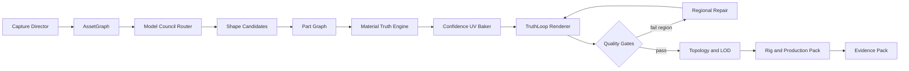

# Consejo de Sabios 3D: superar a Rodin, Tripo, Meshy y Hunyuan

Session 1 | 2026-07-24 | Producto: Xreality Convert

## Veredicto

Xreality no superará a Rodin cambiando Hunyuan por otro checkpoint. La ventaja
defendible es construir un **sistema de creación verificable** que:

1. entiende el activo como partes y materiales, no como una sola malla pintada;
2. pide o genera las vistas que faltan;
3. conserva identidad visible de la referencia;
4. mide cada vista y repara únicamente las regiones defectuosas;
5. entrega topología, materiales y variantes listas para el destino real.

El movimiento 10x se llama **TruthLoop 3D**: generar → renderizar → comparar con
las referencias → localizar error → reparar región → volver a medir. Rodin ofrece
calidad y control; Xreality debe ofrecer además **evidencia, privacidad local y
control reversible**.

## Frontera de evidencia

- La interfaz pública inspeccionada muestra Rodin **Gen-2.5 (0702)**, entrada
  Image to 3D/Text to Image-3D/3D Editing, selección de esfuerzo desde
  Extreme-Low hasta Extreme-High, generación por lotes, direcciones de cámara,
  ControlNet por bounding box/voxel/point cloud y BANG to Parts.
- La arquitectura exacta de Gen-2.5 es propietaria. No se puede afirmar que el
  producto implemente internamente un paper de una forma no documentada.
- Lo reproducible públicamente proviene principalmente de CLAY, BANG,
  Hunyuan3D, TripoSG/SparseFlex, TRELLIS.2, Step1X-3D y herramientas abiertas de
  texturizado, segmentación y rigging.
- Las cifras de velocidad de cada proveedor dependen de hardware cloud y son
  claims del proveedor, no benchmarks comparables con un Mac local.

## El consejo de sabios

| Silla | Aporte comprobable | Lección para Xreality |
|---|---|---|
| Rodin/CLAY | VAE multirresolución, DiT latente 3D, controles 3D y difusión multivista de materiales PBR | Controlar estructura y apariencia como problemas distintos |
| Rodin/BANG | Descomposición recursiva mediante estados explotados y prompts espaciales | El activo debe ser un grafo editable de partes |
| Tripo | Rectified flow, SparseFlex, multivista editable, segmentación, completion y rigging | Un pipeline profesional continúa después de generar |
| Meshy | UX integrada, smart topology, retexturizado, de-lighting, pincel IA, healing y undo | La corrección localizada vale más que regenerar todo |
| Hunyuan3D | Shape/Paint desacoplados, pesos y entrenamiento abiertos, PBR | Base local extensible y auditable |
| TRELLIS.2 | O-Voxel, topología arbitraria y atributos PBR/opacity nativos | No forzar todo a superficies cerradas |
| Step1X-3D | Sincronización latente multivista y transferencia de controles 2D/LoRA | Reutilizar el ecosistema 2D sin perder coherencia 3D |
| Artista 3D | Partes, UV, seams, materiales, retopo, LOD, rig y revisión en movimiento | “Se ve bien en un render” no equivale a activo usable |
| Tech artist | Presupuestos, perfiles de destino, automatización y fallbacks | La salida debe adaptarse a WebXR, Quest, Unity, Unreal o impresión |
| QA visual | Golden set, turntable, heatmaps y gates por categoría | Toda promesa debe tener una prueba visual reproducible |

## Cómo lo hizo Rodin

### Núcleo reproducible

1. **Prior 3D nativo**. CLAY usa un VAE multirresolución para comprimir geometría
   y un Diffusion Transformer latente para generar estructura 3D.
2. **Entrenamiento progresivo y datos curados**. La escala del modelo funciona
   junto con normalización y curación agresiva de activos.
3. **Controles 3D**. Imágenes, multivista, voxel, bounding box, point cloud e
   representaciones implícitas condicionan la generación.
4. **Apariencia separada**. Un modelo multivista genera diffuse/base color,
   roughness y metallic, condicionado por geometría.
5. **Partes mediante BANG**. Un adapter de exploded dynamics y atención temporal
   produce una secuencia coherente de separación; prompts espaciales controlan
   qué se divide.
6. **Producto por encima del modelo**. Quad/raw, PBR/shaded, 2K/4K, fuse/concat
   multiimagen, alpha, preview render, effort tiers y postprocesado.

### Lo que Rodin hace especialmente bien

- trata la estructura, los materiales y las partes como capas diferentes;
- permite editar y dividir sin comenzar desde cero;
- expone esfuerzo/calidad como una decisión de producto;
- integra generación, preview, optimización y exportación;
- acepta controles 3D, no solamente texto o una foto.

### Huecos que Xreality puede explotar

- no publica un gate visual verificable por vista;
- el modelo y los datos son propietarios;
- la corrección cloud no es privada/local-first;
- el usuario no recibe causalidad clara de por qué una región fue inventada;
- “production ready” sigue necesitando validación específica por destino.

## Benchmark competitivo actual

| Sistema | Mejor capacidad | Técnica/flujo | Hueco aprovechable |
|---|---|---|---|
| Rodin Gen-2.5 | Detalle, partes, control y edición | CLAY + BANG + producto integrado | Caja negra y evidencia limitada |
| Tripo v3.1/P1 | Multivista, 2M polígonos, smart mesh y pipeline amplio | TripoSG, SparseFlex, edición/rig API | Dependencia cloud y muchas etapas separadas |
| Meshy 6/T2 | UX, smart topology, de-lighting y Texture Edit | Pipeline propietario con herramientas de producción | Menor transparencia técnica |
| Hunyuan3D 2.1 | PBR abierto y extensible | Shape DiT + Paint multivista | Textura/consistencia todavía frágil en Apple local |
| TRELLIS.2 | Topología arbitraria y PBR nativo | Sparse O-Voxel + 4B DiT | CUDA 24 GB; no viable localmente en M5 como base |
| Step1X-3D | Control 2D transferible y sync multivista | VAE-DiT + SDXL + latent sync | ~27–29 GB VRAM en referencia |
| Xreality hoy | Local-first, auditoría, LOD y materiales por perfil | Hunyuan MLX + gates estructurales | Falta TruthLoop visual, partes y edición local |

## Top 15 features

| # | Feature superior | Qué toma | Cómo lo supera | Gate de aceptación |
|---:|---|---|---|---|
| 1 | **TruthLoop 360** | Rodin control + QA | Renderiza 8–24 vistas, compara y repara sólo fallos | 100% vistas con score y heatmap; no exportar en rojo |
| 2 | **Material Truth Engine** | Hunyuan PBR + Meshy de-light | Segmenta por material y estima base color sin iluminación, normal, roughness, metallic, opacity y emission | Ningún material orgánico metálico salvo override; error PBR por región |
| 3 | **Recursive Part Graph** | BANG + Tripo segmentation | Grafo de partes con jerarquía, nombre, material, unión y lock | Cada parte editable y exportable sin perder transform |
| 4 | **Paint/Heal sobre el 3D** | Meshy Texture Edit | Máscara en pantalla, prompt o foto; repara UV y vistas vecinas con undo | Región no seleccionada cambia <1% |
| 5 | **Active Capture Director** | Multi-image de todos | Calcula incertidumbre y pide exactamente “espalda”, “oreja derecha”, “base” | Cada nueva foto reduce error medido |
| 6 | **Identity Locks** | Referencia visual | Locks para ojos, cara, logos, patrones, texto y colores dominantes | Similitud de cada lock sobre umbral por categoría |
| 7 | **Category Expert Council** | Presets competitivos | Pipelines distintos para persona, animal, producto, hard-surface, madera/metal/óxido/pasto | Gates anatómicos/materiales específicos |
| 8 | **Model Council Router** | Ecosistema abierto | Hunyuan/TripoSG/TRELLIS/Step1X como backends evaluables; ruta por hardware/categoría | Selección justificada y benchmark guardado |
| 9 | **Native Multiview Texture Sequence** | SeqTex/Step1X | Genera una secuencia orbital consistente antes de bakear | Drift de identidad y color bajo umbral circular |
| 10 | **Confidence UV Baker** | Hunyuan Paint | Visibilidad, ángulo, oclusión y confianza por texel; nunca promedia basura | Atlas incluye confidence map y seam score |
| 11 | **Dual Topology Delivery** | Rodin quad/raw + Meshy T2 | Hero mesh y game mesh con correspondencia y bake transferible | Error de superficie/normal dentro del presupuesto |
| 12 | **Local Geometry Edit** | Rodin Edit | Seleccionar parte/región y Add/Remove/Replace sin destruir el resto | Región bloqueada conserva geometría y UV |
| 13 | **Adaptive Effort** | Rodin thinking tiers | Para al alcanzar gates; escala sólo las regiones fallidas | Tiempo/costo trazable y early-exit reproducible |
| 14 | **Part-aware AutoRig** | Tripo + SkinTokens | Rig de humanos, animales y objetos articulados usando el Part Graph | Prer rig check + deformación sin bleeding |
| 15 | **Production Evidence Pack** | Todos, pero verificable | GLB/USDZ/3MF, LOD, collider, thumbnails, turntable y reporte firmado | Blender/Three.js/macOS/target profile pasan automáticamente |

## Top 15 estrategias de implementación

1. **Benchmark antes de modelo**: crear golden set de 60 activos —10 por categoría—
   y comparar shape, identidad, seams, PBR, partes, tiempo y memoria.
2. **Contrato `AssetGraph` primero**: geometría, partes, materiales, vistas, locks,
   lineage y scores deben sobrevivir todas las etapas.
3. **Verdad multivista**: aceptar 1–8 imágenes con dirección; generar vistas
   faltantes sólo como hipótesis etiquetadas.
4. **Separar observación e invención**: texeles vistos se protegen; texeles
   inferidos llevan confidence menor y pueden regenerarse.
5. **De-light antes de PBR**: remover sombra/reflejo del base color y estimar
   propiedades físicas por región, nunca globalmente.
6. **Partes antes de edición**: segmentar y nombrar componentes antes de
   texturizar, optimizar o riggear.
7. **Baking con confianza y oclusión**: peso por ángulo, profundidad, máscara,
   nitidez y consistencia cromática.
8. **Reparación transaccional**: toda edición crea una versión, máscara, prompt,
   seed y diff; undo/redo sin regeneración total.
9. **Evaluación render-in-the-loop**: render PBR bajo HDRI neutro y comparar
   contra cada fuente con silueta, keypoints, DINO/CLIP y color material.
10. **Políticas por categoría**: anatomía animal/persona, simetría/producto,
    bordes/hard-surface, thin surfaces/plantas y printability.
11. **Backend router desacoplado**: mismo contrato para MLX local, CUDA remota u
    opcional cloud; ningún proveedor contamina la UI.
12. **Presupuesto adaptativo**: draft rápido → regiones críticas → hero sólo
    cuando los gates justifican el costo.
13. **Correspondencia entre LODs**: conservar mapas de transferencia para
    texturas, partes, rig y colisiones.
14. **Prueba en destino**: Blender + Three.js + Quick Look + Unity/Unreal/3MF
    según perfil, no solamente parseo GLB.
15. **Flywheel privado de correcciones**: guardar localmente qué versión eligió
    el usuario y qué región reparó; usarlo para ranking/presets, nunca entrenar o
    subir sin consentimiento.

## Prioridad despiadada

### Do Now

1. TruthLoop 360 y golden set.
2. Confidence UV Baker.
3. Material Truth Engine con de-light.
4. Identity Locks.
5. Paint/Heal regional con undo.

### Do Next

1. Recursive Part Graph.
2. Active Capture Director.
3. Category Expert Council.
4. Dual Topology Delivery.
5. Production Evidence Pack.

### Explore

1. Model Council Router.
2. Native Multiview Texture Sequence.
3. Local Geometry Edit.
4. Part-aware AutoRig.
5. Adaptive Effort a nivel de región.

## Plan SDD

### Goal

Convertir Xreality en un sistema local-first que produce activos 3D editables y
verificados, con fidelidad superior a la referencia en las regiones observables
y con incertidumbre explícita en las regiones inventadas.

### Non-goals iniciales

- entrenar un foundation model de 10B;
- prometer CAD exacto desde una sola foto;
- soportar escenas completas antes de dominar activos aislados;
- afirmar superioridad sin benchmark ciego y artefactos descargables.

### Requisitos EARS

- **R1** Cuando el usuario aporte imágenes, el sistema deberá almacenar dirección,
  máscara, calidad y procedencia de cada vista.
- **R2** Cuando falte cobertura, deberá mostrar incertidumbre y recomendar la
  siguiente vista más útil.
- **R3** Mientras un texel esté respaldado por una referencia válida, ninguna
  inferencia deberá reemplazarlo sin aprobación explícita.
- **R4** Cuando se genere textura, deberá producir base color de-lit y mapas PBR
  separados por material.
- **R5** Si dos vistas se contradicen, deberá marcar la región y bloquear
  aprobación automática.
- **R6** Cuando el activo tenga partes detectables, deberá mantener IDs estables,
  jerarquía, nombre, material y transform.
- **R7** Cuando el usuario bloquee una parte o región, una edición posterior no
  deberá alterarla por encima de la tolerancia.
- **R8** Cuando el usuario pinte una máscara, deberá regenerar sólo la región y
  sus márgenes de seam.
- **R9** Después de cada etapa generativa, deberá renderizar vistas de auditoría
  y emitir scores/heatmaps.
- **R10** Cuando falle un gate, deberá conservar el último artefacto aprobado y
  proponer una acción concreta.
- **R11** Para cada perfil de destino, deberá derivar topología, LOD, textura,
  collider, unidades y formatos correspondientes.
- **R12** Cuando existan varios backends, deberá seleccionarlos mediante una
  política observable basada en categoría, hardware y benchmark.
- **R13** Para personajes/articulados, deberá ejecutar prer rig check antes de
  producir skeleton y weights.
- **R14** Toda generación o edición deberá registrar seed, backend, modelo,
  parámetros, inputs y lineage.
- **R15** La exportación final deberá incluir un Evidence Pack reproducible.

### Diseño



#### Componentes

- `AssetGraphStore`: fuente de verdad versionada.
- `CaptureDirector`: cobertura, dirección e incertidumbre.
- `BackendAdapter`: contrato común para shape/texture/segment/rig.
- `PartGraphService`: segmentación, jerarquía y locks.
- `MaterialTruthService`: de-light, clasificación y mapas PBR.
- `ConfidenceBaker`: proyección multivista y atlas de confianza.
- `TruthLoopEvaluator`: render, métricas, heatmaps y gates.
- `RegionalRepairService`: inpaint multivista limitado por máscara.
- `DeliveryCompiler`: LOD, collider, formatos y validadores.

#### Contrato mínimo

```json
{
  "asset_id": "uuid",
  "version": 1,
  "sources": [{"id": "view-front", "azimuth": 0, "observed": true}],
  "parts": [{"id": "head", "parent": "body", "locked": false}],
  "materials": [{"id": "fur", "class": "organic_fur"}],
  "locks": [{"kind": "identity", "part_id": "head"}],
  "artifacts": [{"kind": "shape_glb", "lineage": []}],
  "quality": {"views": [], "regions": [], "gate": "review"}
}
```

### Waves y gates

| Wave | Entrega | Dependencia | Gate |
|---|---|---|---|
| W0 | Golden set + benchmark + turntable reproducible | ninguna | baseline publicado con 60 activos |
| W1 | AssetGraph + multiview dirigido + TruthLoop read-only | W0 | scores por vista repetibles |
| W2 | Confidence Baker + de-light + Material Truth | W1 | mejora medible vs Paint actual |
| W3 | Paint/Heal regional + locks + undo | W2 | cambios fuera de máscara <1% |
| W4 | Part Graph + edición/LOD por parte | W1 | IDs/transform/material sobreviven |
| W5 | Category Council + backend router + adaptive effort | W0–W4 | gana benchmark por categoría |
| W6 | Rig + Production Evidence Pack | W4–W5 | valida en destinos declarados |

### Backlog de implementación

1. Definir manifest del golden set y licencias.
2. Implementar render turntable determinista.
3. Medir silueta, keypoints, identidad, seams y material.
4. Introducir `AssetGraph` sin romper el contrato actual.
5. Aceptar vistas dirigidas en API/UI.
6. Calcular cobertura e incertidumbre por superficie.
7. Implementar de-light del source.
8. Clasificar materiales por región/parte.
9. Reemplazar bake uniforme por confidence-weighted bake.
10. Emitir atlas de confianza y seam heatmap.
11. Añadir locks de ojos/cara/logo/texto/color.
12. Implementar reparación regional versionada.
13. Añadir segmentación de partes con IDs estables.
14. Derivar LOD/topología conservando correspondencias.
15. Añadir adapters y policy del Model Council.
16. Integrar prer rig check y backend de rig.
17. Compilar Evidence Pack y validadores de destino.
18. Ejecutar benchmark ciego Xreality/Rodin/Tripo/Meshy.

### Criterio para declarar “superamos a Rodin”

No usar percepción interna ni screenshots seleccionados. Declararlo solamente si:

- un set ciego independiente cubre las categorías objetivo;
- Xreality gana al menos 4 de 6 métricas principales;
- ninguna mejora depende de ocultar fallos o descartar casos;
- se publican inputs, outputs, parámetros y renders orbitales;
- un artista puede corregir un fallo sin regenerar el activo completo.

## Fuentes primarias y oficiales

- [Hyper3D Rodin actual: controles, partes y flujo](https://hyper3d.ai/)
- [Rodin Gen-2 API: quad/raw, PBR, multiimagen y 4K](https://developer.hyper3d.ai/api-specification/rodin-generation-gen2)
- [CLAY paper](https://arxiv.org/abs/2406.13897)
- [BANG paper](https://arxiv.org/abs/2507.21493)
- [Meshy 6 Image-to-3D API](https://docs.meshy.ai/en/api/image-to-3d)
- [Meshy Texture Edit](https://docs.meshy.ai/en/webapp/guides/texture-edit)
- [Tripo API changelog y modelos 2026](https://platform.tripo3d.ai/docs/changelog)
- [Tripo texture API](https://platform.tripo3d.ai/docs/texture)
- [TripoSG](https://github.com/VAST-AI-Research/TripoSG)
- [SparseFlex/TripoSF paper](https://arxiv.org/abs/2503.21732)
- [Hunyuan3D 2.1](https://github.com/Tencent-Hunyuan/Hunyuan3D-2.1)
- [Hunyuan3D 2.1 paper](https://arxiv.org/abs/2506.15442)
- [TRELLIS.2](https://github.com/microsoft/TRELLIS.2)
- [Step1X-3D](https://github.com/stepfun-ai/Step1X-3D)
- [SkinTokens/TokenRig](https://github.com/VAST-AI-Research/SkinTokens)

## Riesgos

- Los modelos más fuertes de Rodin/Meshy/Tripo son propietarios; sólo podemos
  reproducir principios públicos y medir salidas.
- TRELLIS.2, Step1X y varias herramientas de rig requieren CUDA; son candidatos
  de laboratorio/remoto, no dependencias base del producto Apple local.
- Similitud 2D puede premiar una textura bonita sobre mala geometría; los gates
  deben combinar imagen, superficie, material y topología.
- Segmentación semántica equivocada puede dañar todas las etapas siguientes;
  necesita corrección manual rápida.
- “15 features” no deben desarrollarse en paralelo: W0–W2 resuelven primero el
  defecto visible de textura y crean la evidencia para decidir el resto.
