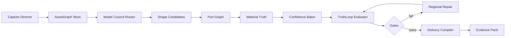

# Design — Xreality TruthLoop 3D

Status: Proposed | Requirements: [requirements.md](requirements.md)

## Architecture



## Components

| Component | Responsibility | Boundary |
|---|---|---|
| `AssetGraphStore` | Source of truth, versions, lineage, locks | No inference |
| `CaptureDirector` | View direction, coverage, uncertainty | No geometry mutation |
| `BackendAdapter` | Common shape/texture/segment/rig API | Provider isolation |
| `PartGraphService` | Stable semantic parts and hierarchy | No destructive merge |
| `MaterialTruthService` | De-light, material class and PBR maps | Per-region output |
| `ConfidenceBaker` | Occlusion-aware projection and confidence atlas | Never overwrite locked texels |
| `TruthLoopEvaluator` | Deterministic renders, metrics, heatmaps and gates | Read-only artifacts |
| `RegionalRepairService` | Masked texture/geometry transactions | Versioned changes |
| `DeliveryCompiler` | LOD, topology, collider, formats and validators | Target-specific |

## Core model

```json
{
  "asset_id": "uuid",
  "version": 1,
  "sources": [
    {"id": "front", "azimuth": 0, "observed": true, "quality": 0.92}
  ],
  "parts": [
    {"id": "head", "parent_id": "body", "locked": false}
  ],
  "materials": [
    {"id": "fur", "class": "organic_fur", "part_ids": ["body", "head"]}
  ],
  "locks": [
    {"id": "eyes", "kind": "identity", "part_id": "head"}
  ],
  "artifacts": [
    {"id": "shape-v1", "kind": "shape_glb", "parents": []}
  ],
  "quality": {
    "gate": "review",
    "views": [],
    "regions": []
  }
}
```

## Backend contract

- `analyze_sources(asset_graph) -> coverage_report`
- `generate_shape(asset_graph, policy) -> candidate[]`
- `segment_parts(candidate) -> part_graph`
- `generate_materials(asset_graph, part_graph) -> material_set`
- `bake(material_set, views, locks) -> atlas_set + confidence`
- `evaluate(artifact, references, profile) -> quality_report`
- `repair(artifact, region, instruction) -> artifact_version`
- `compile(artifact, target_profile) -> delivery_pack`

## Gates

| Gate | Signals | Failure action |
|---|---|---|
| Input | blur, cut subject, background, view | Request exact missing/corrected view |
| Shape | silhouette, keypoints, surface, components | Regenerate shape candidate |
| Identity | eyes/face/logo/text/color locks | Reproject or regional repair |
| Texture | seam, coverage, drift, confidence | Re-bake affected islands |
| Material | class/PBR plausibility | Re-estimate affected material |
| Delivery | topology, LOD, format, runtime render | Recompile profile |

## Decisions

- Keep Hunyuan MLX as the first local adapter; do not couple UI to it.
- Implement the evaluator before adding new foundation models.
- Store observed and inferred evidence separately.
- Preserve shape, texture, parts and delivery as independently versioned artifacts.
- Use optional CUDA/cloud adapters only behind explicit user configuration.
