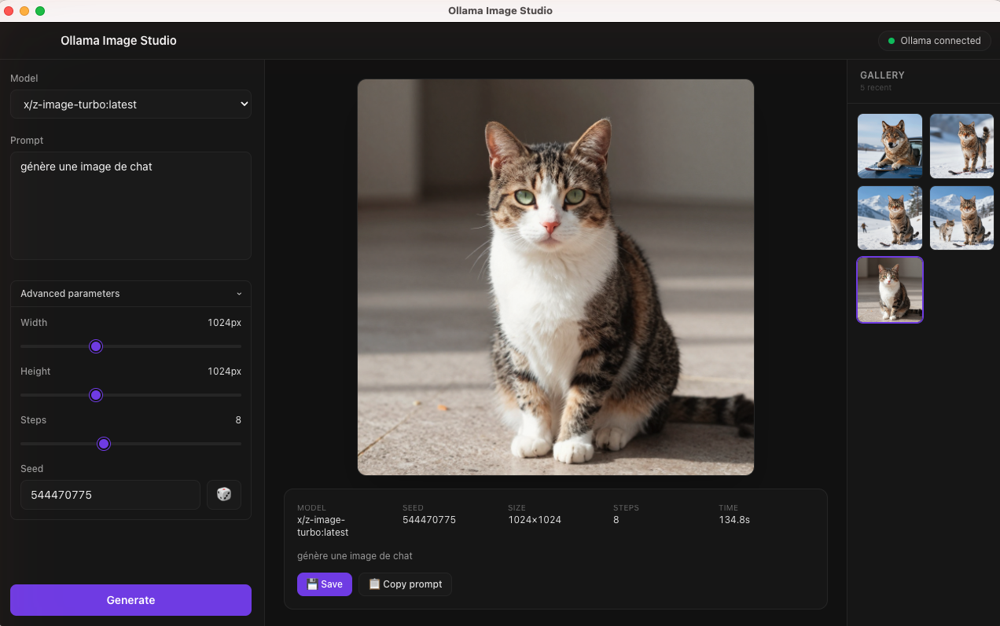
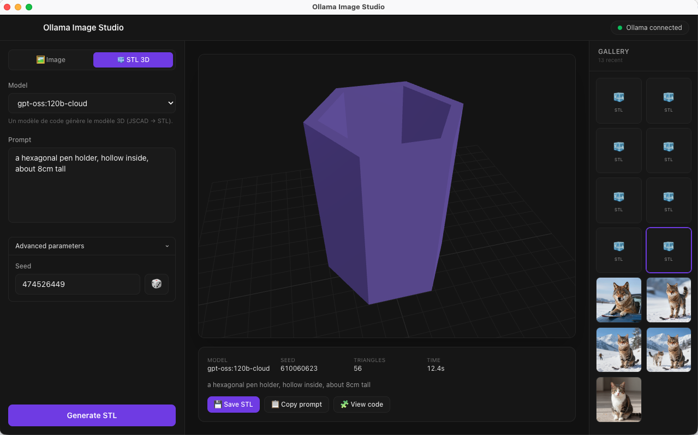

# Ollama Image Studio

Application native macOS pour générer **des images** et **des modèles 3D (STL)** en local avec [Ollama](https://ollama.com) — sans passer par le terminal. Construite avec Electron + React, pensée pour Apple Silicon.





## Fonctionnalités

L'app a **deux modes**, sélectionnables en haut du panneau :

### 🖼️ Mode Image
- Génération d'images via le modèle `x/z-image-turbo` (affiché **en rouge** avec la commande d'installation s'il n'est pas présent).
- Paramètres : largeur / hauteur (512–2048), nombre d'étapes, *seed* (+ bouton aléatoire 🎲).
- Sauvegarde dans `~/Pictures/OllamaImageStudio/`.

### 🧊 Mode STL 3D
- Choix libre du modèle de **code** parmi ceux installés localement.
- Pipeline : *prompt → le modèle écrit du code [JSCAD](https://github.com/jscad/OpenJSCAD.org) → compilation en STL dans l'app → rendu 3D*.
- **Visualiseur 3D interactif** (rotation à la souris, zoom à la molette) via Three.js.
- Bouton **« View code »** pour inspecter le code JSCAD généré.
- Sauvegarde du `.stl` dans `~/Documents/OllamaImageStudio/`.
- Robustesse : *system prompt* détaillé + couche de compatibilité tolérante + **auto-réparation** (si le code échoue, l'erreur est renvoyée au modèle pour correction, jusqu'à 3 essais).

### Commun aux deux modes
- ✅ Vérification automatique de la connexion à Ollama + détection des modèles.
- 🗂️ Galerie des 20 dernières générations (clic = recharge les paramètres). Métadonnées persistées sur disque.
- ⏹️ Génération annulable à tout moment.
- 📋 Copier le prompt, 📂 révéler le fichier dans le Finder.
- 🌙 Thème sombre, barre de titre macOS native.

## Prérequis

- macOS (Apple Silicon recommandé)
- [Ollama](https://ollama.com) installé et lancé : `ollama serve`
- **Pour les images** : `ollama pull x/z-image-turbo`
- **Pour le STL** : un modèle de code. Recommandé pour la meilleure qualité :
  un modèle *cloud* comme `gpt-oss:120b-cloud` ; en local, `qwen2.5-coder` fonctionne aussi.
- Node.js 18+ (pour compiler depuis les sources)

> **Note** : la génération d'image via `/api/generate` d'Ollama est un point d'API expérimental.
> Pour le STL, la qualité dépend fortement du modèle de code choisi : les modèles plus
> puissants produisent des formes nettement plus détaillées.

## Lancer depuis les sources

```bash
git clone https://github.com/koua29/ollama-image-studio.git
cd ollama-image-studio
npm install
npm run dev      # lance Vite + Electron en mode développement
```

## Construire une app distribuable

```bash
npm run build    # produit un .app et un .dmg dans release/
```

Glissez ensuite **Ollama Image Studio.app** dans votre dossier `/Applications`, ou ouvrez le `.dmg`.

## Architecture

```
ollama-image-studio/
├── electron/
│   ├── main.js       # processus principal : IPC, appels HTTP Ollama, pipeline JSCAD→STL
│   └── preload.js    # contextBridge — expose une API sûre window.ollama
└── src/
    ├── App.jsx       # état de l'application
    └── components/   # Header, PromptPanel, ImageViewer, StlViewer, Gallery
```

**Choix techniques**

- Tous les appels HTTP à Ollama se font dans le **processus principal** (module `http` de Node, zéro dépendance) — pas de problème de CORS et le *renderer* reste isolé.
- Le code JSCAD généré par le modèle est exécuté dans un **bac à sable `vm` verrouillé** (pas d'accès fichier/réseau, exécution bornée dans le temps), puis sérialisé en STL.
- Sécurité : `nodeIntegration: false`, `contextIsolation: true`, `sandbox: true`, plus une Content-Security-Policy stricte.

## ☕ Offrez-moi un café

Cette application est gratuite et open source. Si elle vous est utile, vous pouvez me remercier
en m'offrant un café — il suffit de scanner ce QR code PayPal. Merci beaucoup ! 🙏

<p align="center">
  
</p>

## Licence

[MIT](LICENSE) © 2026 Arnaud Soulas
