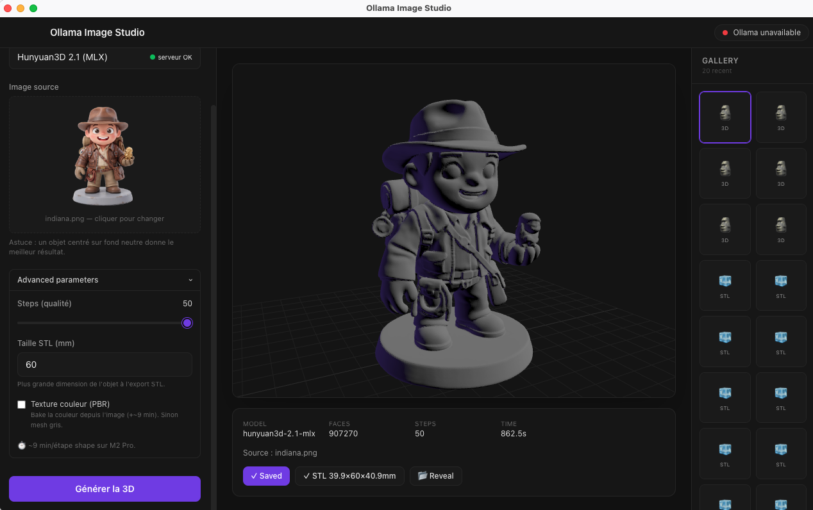

# Xreality Convert Manual / Manual de Xreality Convert

This manual is bilingual. The Spanish version comes first, followed by the English version.

Este manual es bilingüe. La versión en español aparece primero y luego la versión en inglés.

---

## Español

### 1. Qué es

Xreality Convert es una app de escritorio para macOS pensada para crear activos locales sin salir del flujo de trabajo:

- Imagen con Ollama
- Texto a STL 3D con JSCAD
- Imagen a 3D con Hunyuan3D MLX

La aplicación mantiene los modelos, pesos y geometría en local, y muestra diagnóstico, progreso y auditoría para cada trabajo.

### 2. Vista general




### 3. Instalación

1. Descarga el `.dmg` desde la release de GitHub.
2. Arrastra `Xreality Convert.app` a `Applications`.
3. Abre la app.
4. Si macOS muestra una advertencia de seguridad, haz clic derecho sobre la app y elige `Abrir` la primera vez.

### 4. Requisitos

- macOS en Apple Silicon recomendado
- Ollama instalado y en ejecución
- Python 3.11 o 3.12 para el flujo Imagen a 3D
- Conexión local a los modelos de Ollama

### 5. Flujo Imagen

Usa este modo para crear una imagen local:

1. Elige `Crear imagen`.
2. Selecciona el modelo de imagen instalado.
3. Escribe un prompt.
4. Ajusta ancho, alto, pasos y seed si quieres repetibilidad.
5. Pulsa generar.

La imagen generada se guarda localmente y también puede reutilizarse como referencia para Imagen a 3D.

### 6. Flujo Texto a STL

Este modo genera geometría paramétrica con un modelo de código local:

1. Elige `Texto → 3D`.
2. Selecciona un modelo de código instalado.
3. Describe la pieza con la mayor precisión posible.
4. Ajusta perfil, presupuesto de caras y escala.
5. Genera la malla y revisa el visor 3D.
6. Exporta o guarda el STL.

Si el código falla, la app intenta autocorregirlo hasta 3 veces.

### 7. Flujo Imagen a 3D

Este es el flujo más avanzado:

1. Elige `Imagen → 3D`.
2. Selecciona o arrastra una imagen.
3. Revisa el diagnóstico previo.
4. Si hace falta, cambia la categoría o el fondo.
5. Pulsa `Construir activo 3D`.

La app muestra:

- Resolución y encuadre
- Estado de la entrada
- Vista preparada antes de reconstruir
- Progreso del trabajo
- Auditoría de calidad final

La exportación STL se bloquea si la calidad es crítica.

### 8. Buenas prácticas para Imagen a 3D

- Usa una sola figura u objeto principal
- Prefiere PNG con fondo transparente
- Evita elementos cortados por los bordes
- Usa un encuadre casi cuadrado
- Mantén un contraste claro entre sujeto y fondo

### 9. Servidor local Hunyuan3D

El flujo Imagen a 3D usa un servidor Python local.

Instalación esperada:

1. Asegúrate de tener Python 3.11 o 3.12.
2. Ejecuta el instalador integrado de la app.
3. La app recrea el entorno si detecta un venv incompatible.

La app busca Python aunque se abra desde Finder: instalaciones de Homebrew en
Apple Silicon o Intel, Python.org y `~/.local/bin`. Para comprobarlo sin instalar
dependencias:

```sh
/Applications/Xreality\ Convert.app/Contents/Resources/app.asar.unpacked/engine/setup.sh --preflight
```

Si el servidor ya existe en el equipo, la app intenta arrancarlo automáticamente al abrirse.

### 10. Resolución de problemas

- Si Ollama no aparece, comprueba que esté ejecutándose localmente.
- Si Imagen a 3D no inicia, verifica Python 3.11/3.12.
- Si la exportación STL queda bloqueada, revisa la calidad de la reconstrucción.
- Si la app no abre por seguridad, usa clic derecho > `Abrir` la primera vez.

### 11. Atajos útiles

- `Generar` inicia el flujo actual
- `Cancelar` detiene el trabajo en curso
- La galería reabre resultados e historial locales

---

## English

### 1. What it is

Xreality Convert is a macOS desktop app for keeping asset creation local:

- Image generation with Ollama
- Text to 3D STL with local JSCAD
- Image to 3D reconstruction with local Hunyuan3D MLX

The app keeps models, weights, and geometry on your machine and surfaces diagnosis, progress, and quality checks for every job.

### 2. Overview


### 3. Installation

1. Download the `.dmg` from the GitHub release.
2. Drag `Xreality Convert.app` into `Applications`.
3. Launch the app.
4. If macOS warns you on first launch, right-click the app and choose `Open`.

### 4. Requirements

- Apple Silicon macOS recommended
- Ollama installed and running
- Python 3.11 or 3.12 for Image to 3D
- Local access to the Ollama models you want to use

### 5. Image workflow

Use this mode to generate images locally:

1. Choose `Create image`.
2. Select an installed image model.
3. Write a prompt.
4. Adjust width, height, steps, and seed as needed.
5. Generate the image.

The result is saved locally and can be reused as a reference for Image to 3D.

### 6. Text to STL workflow

This mode generates parametric geometry with a local code model:

1. Choose `Text → 3D`.
2. Select an installed code model.
3. Describe the object as precisely as possible.
4. Adjust profile, face budget, and scale.
5. Generate and inspect the 3D preview.
6. Export or save the STL.

If the generated code fails, the app retries up to 3 times with repair feedback.

### 7. Image to 3D workflow

This is the most advanced path:

1. Choose `Image → 3D`.
2. Select or drag in an image.
3. Review the preflight diagnosis.
4. Change category or background if needed.
5. Click `Build 3D asset`.

The app shows:

- Resolution and framing
- Input status
- Prepared preview before reconstruction
- Live job progress
- Final quality audit

STL export is blocked when the quality gate is critical.

### 8. Best practices for Image to 3D

- Use one main subject
- Prefer transparent PNGs
- Avoid cropped edges
- Keep the framing close to square
- Keep strong subject/background contrast

### 9. Local Hunyuan3D server

Image to 3D uses a separate local Python server.

Expected setup:

1. Make sure Python 3.11 or 3.12 is installed.
2. Run the built-in installer from the app.
3. The app recreates the environment if it detects an incompatible venv.

The app finds Python even when launched from Finder: Homebrew paths on Apple
Silicon or Intel, Python.org, and `~/.local/bin`. To verify discovery without
installing dependencies:

```sh
/Applications/Xreality\ Convert.app/Contents/Resources/app.asar.unpacked/engine/setup.sh --preflight
```

If the server already exists on the machine, the app tries to start it automatically on launch.

### 10. Troubleshooting

- If Ollama is missing, check that it is running locally.
- If Image to 3D does not start, verify Python 3.11/3.12.
- If STL export is blocked, check the reconstruction quality.
- If macOS blocks the app on first launch, use right-click > `Open`.

### 11. Useful actions

- `Generate` starts the active workflow
- `Cancel` stops the current job
- The gallery reopens local results and history
