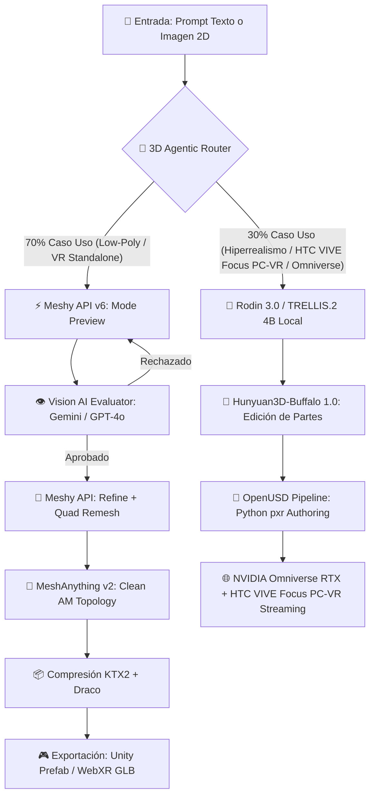

# 📘 INFORME MAESTRO INDUSTRIAL: 3D AGÉNTICO, MESHY API, LOW-POLY VR & OPENUSD DIGITAL TWINS
### 🎨 *Guía Definitiva con Diagramas, Teorías, Hacks de Producción y Recetario Paso a Paso*

---

## 📌 Resumen Ejecutivo de la Estrategia (70% / 30%)

| Métrica / Parámetro | 🟩 **70% del Flujo: Low-Poly VR-Ready** | 🟦 **30% del Flujo: Hiperrealismo PC-VR (HTC VIVE Focus)** |
| :--- | :--- | :--- |
| **Casos de Uso** | Entornos Standalone (Meta Quest 3, VIVE Focus standalone), WebXR, Videojuegos Mobile. | Simulación Industrial, Digital Twins en NVIDIA Omniverse, PC-VR Tethered (HDMI/DisplayPort). |
| **Presupuesto Poligonal** | $\le 5.000 - 10.000$ Triángulos por asset. | $\ge 50.000 - 200.000$ Triángulos (Hero Detail). |
| **Topología** | Quad-dominant limpia (MeshAnything v2 / Meshy Quad Remesh). | Malla densa con mapas de normales 8K. |
| **Motor de IA Recomendado** | **Meshy v6 (`topology: "quad"`)** + **MeshAnything v2**. | **Deemos Rodin 3.0** + **TRELLIS.2 (Local 4B)**. |
| **Compresión VRAM** | KTX2 / Basis Universal (ETC1S) + Draco. | KTX2 UASTC High-Fidelity + PBR de-lit 8K. |
| **Formato de Entrega** | `.glb` / `.usdz` / Prefab Unity. | `.usd` / `.usdc` (OpenUSD NVIDIA Omniverse) / `.usdz`. |

---

## 📊 1. Esquemas Visuales y Diagramas de Arquitectura (Mermaid)

### 🔄 Diagrama del Pipeline Completo de Generación y Enrutado Inteligente



---

## 🛠️ 2. Guía Paso a Paso Definitiva de la API de Meshy v6

### 🚀 Paso 1: Autenticación e Ingesta Asíncrona
Todas las solicitudes a la API de Meshy requieren un token de portador `Bearer` en el encabezado `Authorization`:

```bash
curl -X POST https://api.meshy.ai/v1/text-to-3d \
  -H "Authorization: Bearer YOUR_MESHY_API_KEY" \
  -H "Content-Type: application/json" \
  -d '{
    "mode": "preview",
    "prompt": "Low poly industrial robot arm, game ready, clean quads",
    "art_style": "realistic"
  }'
```

### ⚡ Paso 2: El Hack "Cheap Preview Filter" (Ahorro del 70% de Créditos)
En lugar de lanzar el refinado de alta resolución directamente:
1. Pides `mode: "preview"`. Devuelve en segundos un `task_id` y mapas de previsualización 2D.
2. Tu backend consulta la imagen 2D devuelta a través de un modelo de visión.
3. Solo si pasa la prueba, envías el refinado:

```bash
curl -X POST https://api.meshy.ai/v1/text-to-3d \
  -H "Authorization: Bearer YOUR_MESHY_API_KEY" \
  -H "Content-Type: application/json" \
  -d '{
    "mode": "refine",
    "preview_task_id": "018e3a2b-7c1d-7000-8000-123456789abc",
    "texture_richness": "high"
  }'
```

### 🧩 Paso 3: Retexturizado de Mallas Propias Externa (`/v1/retexture`)
Para aplicar texturas PBR a mallas creadas manualmente o CAD:

```bash
curl -X POST https://api.meshy.ai/v1/retexture \
  -H "Authorization: Bearer YOUR_MESHY_API_KEY" \
  -H "Content-Type: application/json" \
  -d '{
    "model_url": "https://tuservidor.com/malla_cad.glb",
    "text_style_prompt": "Clean industrial steel with subtle wear and yellow hazard stripes",
    "remove_lighting": true
  }'
```

---

## 🏭 3. Pipeline Digital Twins & OpenUSD para NVIDIA Omniverse

Para que los modelos 3D sean 100% compatibles con **NVIDIA Omniverse RTX** y la suite de simulación industrial:

### A. Reglas de Compatibilidad de Escena USD
1. **Unidades Métricas:** El escenario de OpenUSD debe tener `metersPerUnit = 1.0` (1 unidad USD = 1 metro real).
2. **Eje Vertical:** `upAxis = "Y"`.
3. **Esquema de Materiales:** Usar el Shader estándar `UsdPreviewSurface` o `OmniversePBR` con mapas de textura PBR desacoplados.

### B. Ejemplo de Código Python (`pxr`) para Generar la Estructura USD
El script [conversor_openusd_vr_ready.py](file:///Users/mramospe/.gemini/antigravity/brain/56ecdc5a-6659-4b78-bb5d-d42fe49900ab/conversor_openusd_vr_ready.py) automatiza la creación del Stage de USD.

---

## 🎯 4. Prompt Engineering Matrix (Low-Poly vs High-Poly Hiperrealista)

| Objetivo | Prompt Positivo Optimizado | Prompt Negativo (Negative Prompt) |
| :--- | :--- | :--- |
| 🟩 **70% Low-Poly VR** | `Low poly 3D asset, game-ready, clean quad topology, flat shaded, mobile optimized, isometric view, vibrant colors, clear silhouette` | `High poly, dense mesh, messy topology, noise, realistic shadows, baked lighting, blur, artifacts, non-manifold` |
| 🟦 **30% Hiperrealismo HTC VIVE Focus** | `Hyperrealistic 8K hero asset, highly detailed micro-textures, industrial design, realistic metal surface, PBR materials, de-lit texture, photorealistic` | `Low poly, cartoon, anime, stylized, blurry, low resolution texture, baked shadows, distorted geometry` |

---

## 🥽 5. Configuración Específica para HTC VIVE Focus (Modo Tethered PC-VR)

Para exprimir los gráficos hiperrealistas en las gafas **HTC VIVE Focus 3 / VIVE XR Elite**:

1. **Conexión:** Usar cable USB-C 3.2 Gen2 / DisplayPort Streaming a 5 Gbps para evitar compresión de imagen.
2. **Tasa de Refresco Target:** 90 FPS estables.
3. **Resolución de Renderizado:** $2448 \times 2448$ píxeles por ojo (4.8K Total).
4. **Shader Pipeline:** Usar **HDRP (High Definition Render Pipeline)** en Unity o **Unreal Engine 5 Deferred Renderer** aprovechando el paquete OpenUSD importado.
5. **Configuración de Sombras:** Sombras dinámicas mediante mapas PBR de-lit (generados activando `"remove_lighting": true` en Meshy API).

---

## 💡 6. Los 10 Hacks Supremos de Ahorro y Eficiencia

1. 💡 **Base64 Direct Data URIs:** Pasa imágenes dinámicas directamente como cadenas Base64 sin almacenarlas en buckets S3 temporales.
2. 💡 **Pivotes Automáticos (`origin_at: "bottom"`):** Garantiza que los modelos se instancien directamente sobre superficies sin offsets en el eje Y.
3. 💡 **Escala Física (`auto_size: true`):** Evita rescale manual en Blender/Unity.
4. 💡 **Webhooks Asíncronos:** Elimina bucles `while true` de polling en tu servidor backend.
5. 💡 **Formatos Múltiples de 1 Solo Pase:** Solicita `["glb", "fbx", "usdz"]` en el payload inicial.
6. 💡 **Remesh Cuadrangular:** Pide `"topology": "quad"` para assets orgánicos y `"triangle"` para estáticos.
7. 💡 **Texture Packing PBR (ORM):** Empaqueta Occlusión Ambiental (R), Roughness (G) y Metalness (B) en un único canal de textura PNG.
8. 💡 **Transcodificación KTX2:** Comprime texturas a formato Basis Universal para ahorrar hasta un 75% de memoria de GPU en VR.
9. 💡 **LOD Groups en Unity:** Automatiza la distancia de renderizado en Unity con [MeshyUnityAssetImporter.cs](file:///Users/mramospe/.gemini/antigravity/brain/56ecdc5a-6659-4b78-bb5d-d42fe49900ab/MeshyUnityAssetImporter.cs).
10. 💡 **Drivers de Animación Disney:** Aplica deformación con conservación de volumen usando [blender_mcp_automation.py](file:///Users/mramospe/.gemini/antigravity/brain/56ecdc5a-6659-4b78-bb5d-d42fe49900ab/blender_mcp_automation.py).
